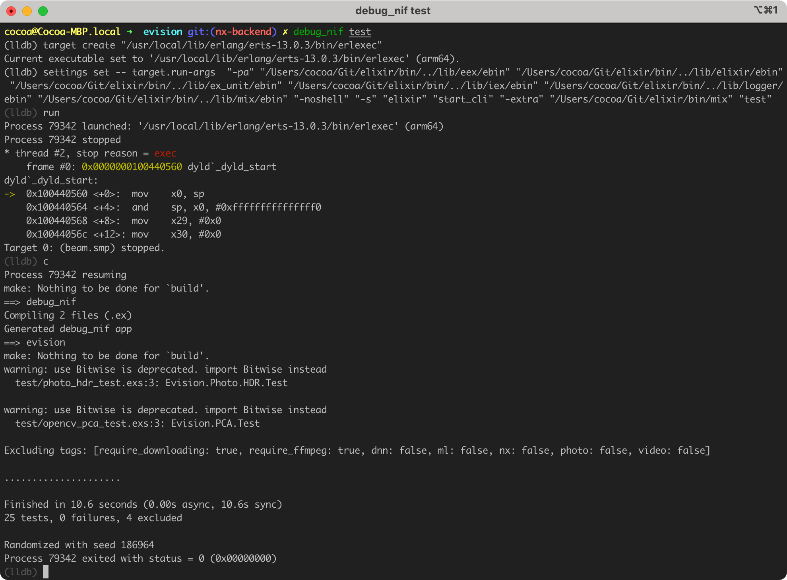

# DebugNIF

An escript for debugging a NIF library in a debugger. It automates the process described here, [Debug Erlang NIF library on macOS and Linux](https://cocoa-research.works/2022/02/debug-erlang-nif-library/).



## Build and Installation
```shell
$ mix do escript.build + escript.install
```

## Usage
```shell
$ debug_nif --help
synopsis:
    A convenient script for debugging NIF libraries.
usage:
    $ debug_nif {options} arg1 arg2 ...
    is equvilent to call `mix arg1 arg2 ...`
options:
    --print-only          Only print commands and necessary environment variables
                          for running the debugger.
    --print-cmd-only      Only print commands for running the debugger.
    --debugger=DEBUGGER   Set which debugger to use. `lldb` is the default for
                          macOS and `gdb` is the default for linux.
    --generate=TYPE       It's possible to generate a Xcode project on macOS for
                          debugging or profiling with Xcode. [TODO]
```
