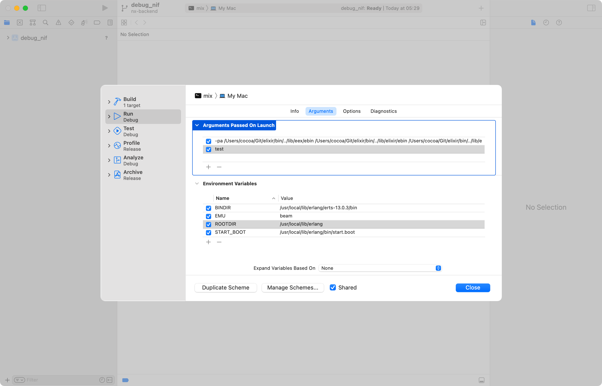

# DebugNIF

An escript for debugging a NIF library in a debugger. It automates the process described here, [Debug Erlang NIF library on macOS and Linux](https://cocoa-research.works/2022/02/debug-erlang-nif-library/).

Works on macOS (CLI and Xcode) and Linux.





## Build and Installation

```shell
# clone this repo
$ git clone https://github.com/cocoa-xu/debug_nif.git
$ cd debug_nif
$ mix do escript.build + escript.install

# or directly build from HEAD
$ mix escript.install github cocoa-xu/debug_nif

# or install a specific version
# please see the release page for all available versions
$ mix escript.install github cocoa-xu/debug_nif tag v0.1.1
```

By default the `debug_nif` escript will try to download precompiled NIF binaries from GitHub. If there is no corresponding precompiled binary for your machine, you can build it from source by

```shell
export DEBUG_NIF_USE_PRECOMPILED=NO
# then call `mix escript.install ...`
```

## Usage
First thing first, don't forget to compile the NIF library with debug info, the compilation flags  should contains something like `-g3 -fno-omit-frame-pointer`.

```shell
# this is equvilent to call `mix test` 
# but run everything in the debugger
$ debug_nif test
```

For macOS, it's also possible to generate an Xcode project with
```shell
# the following command generates an Xcode project
# in the current working directory, and if the project
# exists, it will be overwritten
$ debug_nif --generate=xcode \
  --generate-out="$(pwd)" \
  --generate-overwrite=y \
  test
```

An "mix" sceheme will be available in the generated Xcode project. It contains all necessary environment variables and launch arguments for debugging or profiling.


```shell
$ debug_nif --help
usage:
    $ debug_nif {options} arg1 arg2 ...
    # equvilent to call `mix arg1 arg2 ...`
options:
    --print-only               Only print commands and necessary environment variables
                               for running the debugger.
    --print-cmd-only           Only print commands for running the debugger.
    --debugger=DEBUGGER        Set which debugger to use. `lldb` is the default for
                               macOS and `gdb` is the default for linux.
    --generate=TYPE            It's possible to generate an Xcode project on macOS for
                               debugging or profiling with Xcode.
                               Currenly, the only valid value is `xcode`.
    --generate-out=DIR         Save generated file to the given directory.
    --generate-overwrite=[yN]  Overwrite existing generated files. Default is no.
```
